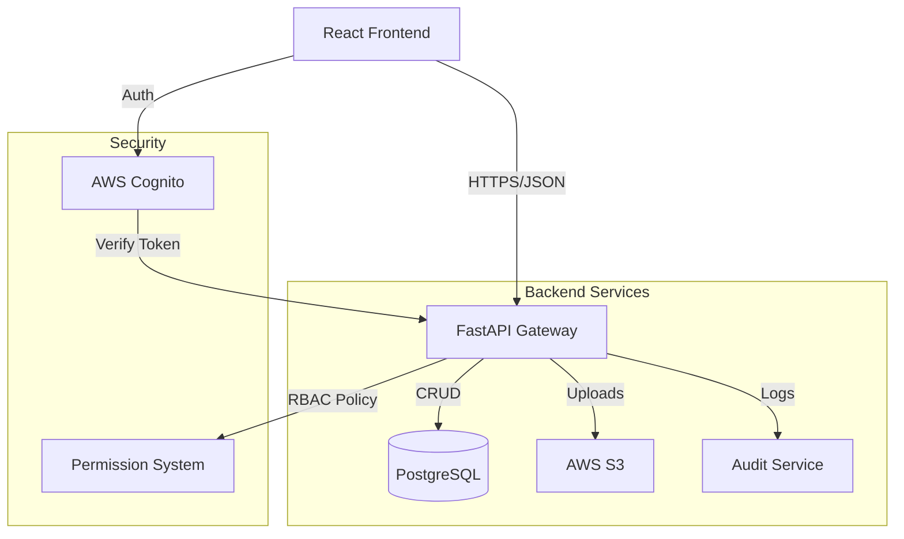

# HomeBrewz ☕
**Direct-to-Consumer Specialty Coffee Marketplace**

HomeBrewz is a full-stack e-commerce platform that connects independent coffee roasters directly with coffee enthusiasts. The platform supports multi-vendor sales, secure role-based access, and real-time order tracking.


---

## 🚀 Product Overview

HomeBrewz solves the challenge of discovering and buying from micro-roasters by aggregating them into a single, seamless marketplace.

### Key Features
*   **For Customers**: Browse specialty coffees, filter by roast/origin, secure checkout (guest & user), and order history.
*   **For Roasters**: Dedicated **Seller Dashboard** with secure **Multi-Tenant Isolation**.
    *   **Real-time Analytics**: View "Total Sales", "Orders to Fulfill", and "Low Stock" alerts at a glance.
    *   **Inventory Management**: Create/Edit products with drag-and-drop image uploads (via secured S3 presigned URLs).
    *   **Order Fulfillment**: Track and update order status (e.g., from "Processing" to "Shipped"), visible instantly to customers.
*   **For Admins**: Platform-wide oversight of users, roasters, and transactions.
*   **Key Highlights**:
    *   **Guest Checkout**: Seamless purchasing without account creation.
    *   **Demo Account**: One-click login for easy portfolio review.
    *   **Responsive Design**: Mobile-first UI with Vanilla CSS & Tailwind.


*(Note: The dashboard implements strict RLS-like logic in the application layer, ensuring roasters can only query their own data.)*

---

## 🏗 Architecture

The project follows a modern, scalable **Monorepo** architecture designed for performance and maintainability.

### Tech Stack
*   **Frontend**: React (Vite), TypeScript, TailwindCSS, React Query.
*   **Backend**: Python FastAPI, SQLModel/SQLAlchemy (Async), Pydantic. *(Note: Backend checks are currently mocked for demo/client-side focus)*
*   **Database**: PostgreSQL (Production-ready).
*   **Auth**: AWS Cognito (JWT-based authentication) & Custom Context.
*   **Infrastructure**: Docker, AWS Amplify (Frontend), AWS App Runner (Backend).
*   **Storage**: AWS S3 (Presigned URLs for secure uploads).

### Data Flow & Components


---

## 🔒 Security & RBAC

Security is a first-class citizen in HomeBrewz.

*   **Multi-Tenancy**: Strict **Vendor Boundary Enforcement** ensures roasters can *only* access their own products and orders. Access is validated at the dependency logic layer (`deps.get_current_roaster`).
*   **Role-Based Access Control (RBAC)**:
    *   `SITE_ADMIN`: Full system access.
    *   `ROASTER_ADMIN`: Can manage staff and roaster profile.
    *   `ROASTER_STAFF`: Can manage orders and inventory.
    *   `CUSTOMER`: Shopper access only.
*   **Secure Uploads**: Files are uploaded directly from Client to S3 using **Presigned URLs** generated by the backend, preventing server bottlenecks and credential leakage.
*   **Audit Logging**: Critical actions (Product creation, Inventory updates) are logged via `AuditService` for compliance.

---

## 🛠 API Documentation

The backend exposes a fully documented REST API compliant with OpenAPI standards.

### Running Locally
1.  **Backend**:
    ```bash
    cd backend
    pip install -r requirements.txt
    uvicorn app.main:app --reload
    ```
2.  **Frontend**:
    ```bash
    cd frontend
    npm install
    npm run dev
    ```

### Interactive Docs (Swagger UI)
Once running, visit `http://localhost:8000/docs` to explore endpoints:
*   `GET /api/v1/products`: List and filter coffees.
*   `POST /api/v1/orders`: Create new orders.
*   `GET /api/v1/uploads/presigned`: Generate secure upload links.

---

## ☁️ Deployment

The project leverages AWS for a serverless-like experience.

### Frontend (AWS Amplify)
*   **Method**: CI/CD connected to GitHub.
*   **Build Settings**: See `amplify.yml`.
*   **Env Variables**: `VITE_API_URL`, `VITE_COGNITO_USER_POOL_ID`.

### Backend (AWS App Runner / Container)
*   **Containerization**: `Dockerfile` included in `backend/`.
*   **Config**: Stateless service scaling automatically with traffic.
*   **Env Variables**: `DATABASE_URL`, `COGNITO_CLIENT_ID`, `AWS_ACCESS_KEY_ID`.

---

## 📝 Notes for Recruiters

Welcome! This project demonstrates my ability to build full-stack applications with a focus on:
1.  **System Design**: The architectural choices (split frontend/backend, secure file uploads) reflect real-world scalability considerations.
2.  **Product Thinking**: Features like **Guest Checkout** and **Demo Mode** were implemented to prioritize user acquisition and ease of review.
3.  **Modern tooling**: Utilizing Vite for fast builds and Tailwind for rapid, consistent styling.

While the backend logic is fully structured (schemas, endpoints, services), the deployed version currently runs in a **Client-Side Demo Mode** to ensure high availability and responsiveness for portfolio reviewers without incurring always-on backend costs.

---

## 🗺 Future Roadmap

*   [ ] **Subscriptions**: Recurring coffee deliveries (Stripe Billing).
*   [ ] **Stripe Connect**: Automated payouts to roasters.
*   [ ] **Promotions Engine**: Coupon codes and seasonal discounts.
*   [ ] **Refunds & Disputes**: Self-service portal for issue resolution.
*   [ ] **Email Notifications**: Transactional emails (SQS + SES).

---

*Built by Richard Santiago - 2026*
